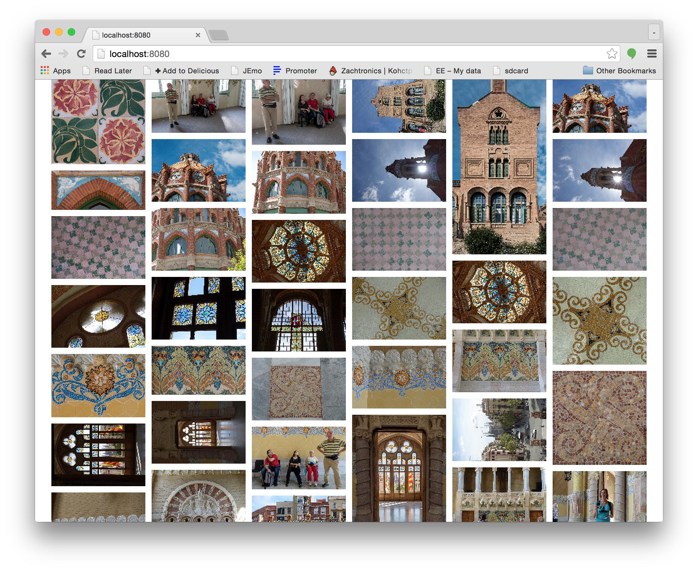

# image-grid

A simple image-grid for displaying images like this

Effectively the same as tumblr's archive view.

Nearly all processing happens in the browser. A simple node server gets a list of
images from one or more folder trees. It then serves those images and a simple viewer.

The viewer reads the list of images and then proceeds to download each one, generate
a thumbnail and place the thumbnails in columns.

Click an image to see it larger. Click the X to close.

Videos are also supported.

**Note:** This system is meant to display files on your local machine for you to browse your
own images. It is not meant to publically serve images. If that's what you want you
would want to generate thumbnails on the server so you can send the smallest amount of
data possible. This on other hand always sends the full res images to the browser and
the browser makes thumbnails.

It was just the quickest way of getting an image browser in the format I wanted.

## Installing

1.  Install node.js [from here](http://nodejs.org/en/download/).
2.  Download or clone this repo.
3.  cd to the repo and type `npm install`

## Running

type

    node index.js path/to/images

Then open a browser and go to `http://localhost:8080`

**Note:** you can pass multiple paths

    node index.js path/to/images path/to/more/images path/to/yet/more/images

## Usage

*   Click an image to view it.
*   Click X to close.
*   Click on left of window to go to previous image (or press `⇦` or left shift)
*   Click on right of window to go to next image (or press `⇨` or left ctrl)
*   Click on stretch icon to cycle between the following (or press `.` or `z`)

    
    stretch to fit in both dimensions

    
    show in original size

    
    stretch to fit width

    
    stretch to fit height

*   Click on rotate icon to rotate in increments of 90 degrees (or press `/` or `a`)

    

*   Press 1, 2, 3, 4, or 5 to set the playback speed of videos

        1 = normal speed
        2 = 2/3rd speed
        3 = 1/2 speed
        4 = 1/3 speed
        5 = 1/4 speed

*   Hover over top of window to show filename

*   Hover over bottom of window to show video controls

*   Press `q` or `tab` to go forward 30 seconds, `w` or `backtick` to go backward 15 seconds.

*   Press `l` to set a loop start point, again to set the end and start looping, again to stop looping.

Also note: There is "go fullscreen" button. If you want to go fullscreen pick it from the menus
of your browser or press the appropriate hotkey.

## Settings

Viewer settings can be set in the URL by adding `?setting=value&setting=value`. For example
`http://localhost:8080?columnWidth=300` will make the columns 300 pixels wide instead of the default 160.

### `columnWidth`

the width of a column in css pixels. The default is 160

### `minSize`

any image below this size is not displayed. The default is 256. Note gifs ignore this rule

### `padding`

amount of padding to put between images. The default is 10.

## TODO

*   Make scroll to current thumbnail or at least keep thumbnail on page

*   Make it sort (or at least optionally)

*   Slideshow

*   Make it work correctly on Safari

    Safari is the new IE. It's now the shitty browser that doesn't follow standards and has bugs.
    In this case Safari seems very unhappy with rotated and scaled videos. Where as Chrome and
    Firefox seem to have no problem, in Safari if the video is larger than the page you can
    not scroll over the the parts off the screen.

    It might be possible to fix this by adding an extra non-video element to match the video?
    No idea.

    Also if the video is rotated, switching to
    another video often doesn't show the video. You can here it playing but it's not visible.
    Sometime scrolling down then scrolling back up exactly where you were a moment ago will
    fix it. I have idea for a workaround.

## License

MIT

